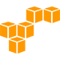

## Hi 👋 I'm christine!
I'm an engineer who is passionate about software and infra.  I enjoy working with

- :cloud:   cloud infra
-    containers & orchestration
-   systems administration
-    software delivery
-   monitoring & alerting
-    software applications

## 💻 My Stats

 
 :octocat: <b>My Github Stats</b>: 

 

  

  

## Connect with me

